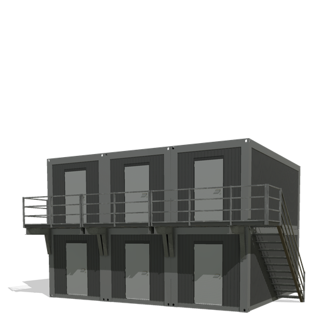

# Platzierbare Baustellen Container – Landwirtschafts-Simulator Mod

Die Platzierbaren Baustellen Container sind Ideal um ihre eigene Baustellen Einrichtung abzurunden.

## 🧱 Credits

- Modell, Texturen, XML & Scripts: **fmods**
- Danke an Came für testen meiner Mods
  
## 📜 Lizenz

Dieser Mod darf **nicht ohne Zustimmung weiterverbreitet oder verändert** hochgeladen werden.

## 📎 Hinweise

- Mod befindet sich aktuell in der finalen Testphase
- Für Feedback, Bugs oder Ideen bitte Kontakt über Discord: `fmods` oder über GitHub Issues

📥 [Mod herunterladen](https://mega.nz/file/jxp1SQjT#rkeQ2FNlPpIAvVGRnzat2lB9TUw8HH5LjoMe0psTQ0E)

**Viel Spaß!**  
*– fmods*
